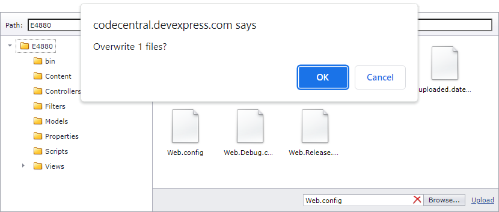

<!-- default badges list -->

<!-- default badges end -->
# FileManager for ASP.NET MVC - How to allow users to overwrite an existing file
The File Manager control prevents users from uploading files that already exist on the server. This example demonstrates how to show a conformation dialog that allows users to overwrite an existing file or cancel the upload operation.

Before the control starts uploading a file, the handler of the client-side [FileUploading](https://docs.devexpress.com/AspNet/js-ASPxClientFileManager.FileUploading) event checks whether a file with the same name exists on the server. If the server contains the file, a confirmation dialog appears and allows the user to overwrite the file or cancel the upload operation. The hander saves the user choice in a [hidden input element](https://learn.microsoft.com/en-us/dotnet/api/system.web.mvc.html.inputextensions.hidden?view=aspnet-mvc-5.2).

The handler of the server-side [FileUploading](https://docs.devexpress.com/AspNet/DevExpress.Web.ASPxFileManager.FileUploading) event obtains the hidden element's value. If the user chose to overwrite the file, the handler deletes the existing file and starts the upload operation.

## Files to Review

* [HomeController.cs](./CS/S37186_MVC/Controllers/HomeController.cs)
* [Global.asax](./CS/S37186_MVC/Global.asax)
* [_FileManagerPartial.cshtml](./CS/S37186_MVC/Views/Home/_FileManagerPartial.cshtml)
* [Index.cshtml](./CS/S37186_MVC/Views/Home/Index.cshtml)

## Documentation

- [File Manager](https://docs.devexpress.com/AspNet/9032/components/file-management/file-manager)
